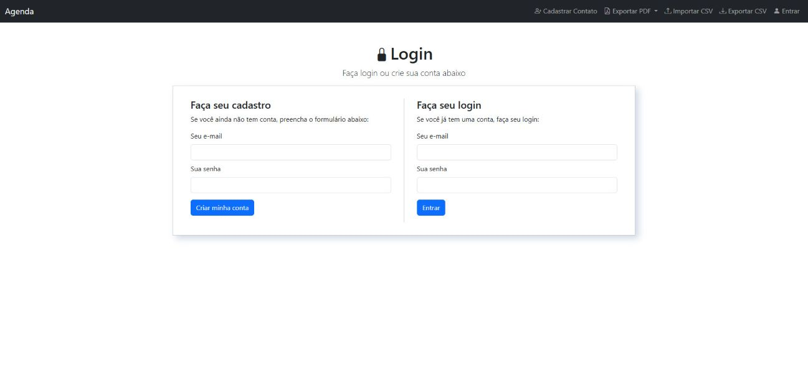
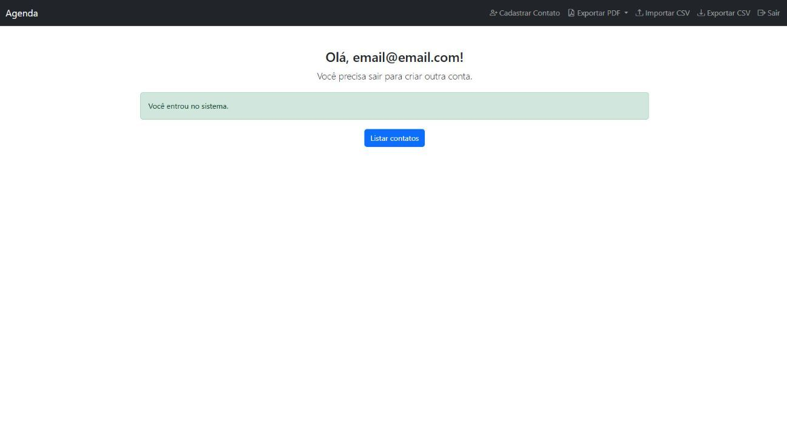
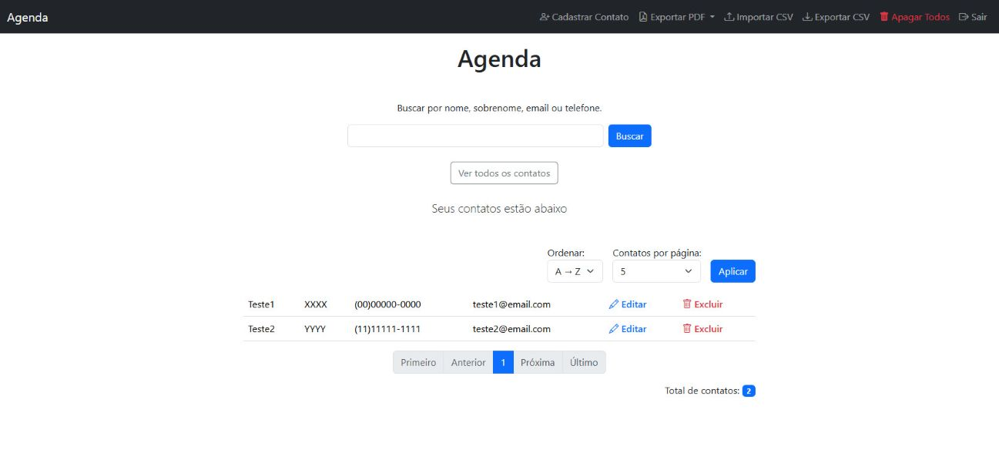
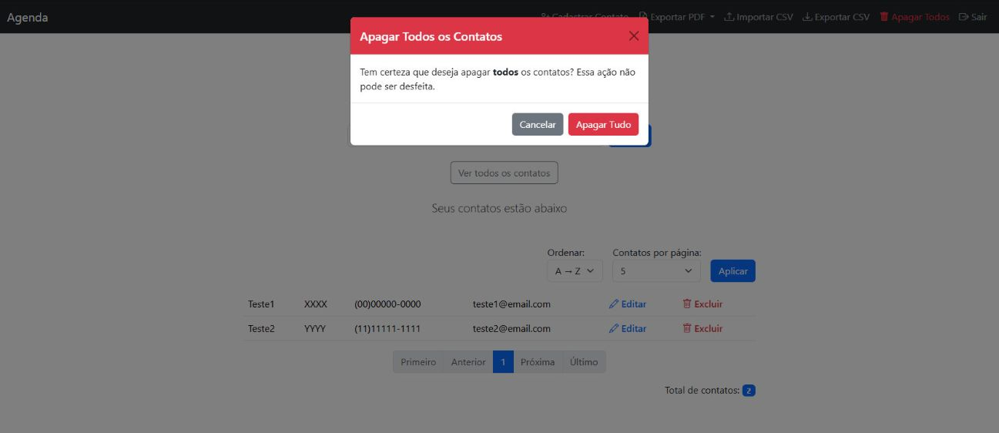
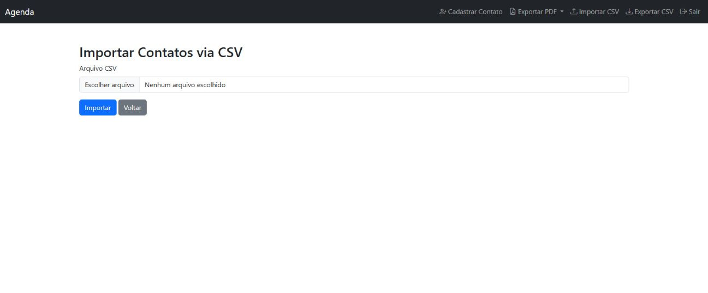

# 📒 Agenda Project - Node.js + Express + MongoDB

Web-based contact manager application built with Node.js, Express, MongoDB, and EJS. Allows authenticated users to register, edit, view, import, and export contacts.

---

## 🚀 Features

- 🔐 Login and logout with session  
- ✅ User registration  
- 📇 Contact registration with name, surname, email, and phone  
- 🔀 Contact sorting (A → Z / Z → A)  
- 🔍 Contact search with pagination  
- ✏️ Edit existing contacts  
- 🗑️ Delete individual or multiple contacts  
- 📤 Export contacts to PDF or CSV  
- 📥 Import contacts via CSV file  
- ⚠️ Data validation (required name, valid email, at least one contact method)  
- 🔒 Route protection with authentication middleware  
- 💬 Error and success messages using `connect-flash`  
- 🛡️ CSRF protection  

---

## 🖼️ User Interface

### 🔐 Login Screen
Displays the registration and authentication form.



### 👋 Welcome Page (Dashboard)
Displayed after login, greeting the user and providing access to main features.



### 📝 Contact Form
Form to add or edit a contact with name, surname, email, and phone.


### 📋 Contact List
Displays registered contacts with options to edit, delete, and sort.



### 🗑️ Delete All Contacts
Allows deleting all contacts at once, with confirmation.



### 📥 CSV File Upload
Allows bulk import of contacts via CSV file, with automatic data validation.



---

## 🧱 Project Structure

```bash
AGENDA/
├── frontend/                          # Frontend code
│   ├── assets/                        # Static frontend assets
│   │   ├── css/                       # Stylesheets
│   │   ├── img/                       # Interface images
│   │   └── js/                        # JavaScript files bundled by Webpack
│   ├── modules/                       # JS modules for form validation
│   │   ├── CadastroContato.js         # Contact form validation
│   │   └── Login.js                   # Login/registration form validation
│   └── main.js                        # Main script that initializes modules
├── public/                            # Public files accessible by browser
│   └── assets/                        # Webpack output
│       ├── bundle.js                  # Bundled JS file
│       └── bundle.js.map              # Source map for debugging
├── src/                               # Backend code
│   ├── assets/                        # Internal assets like fonts and images
│   ├── controllers/                   # Route logic and flow control
│   ├── middlewares/                   # Custom middlewares
│   ├── models/                        # Data models (e.g., Mongoose)
│   ├── tests/                         # Automated tests
│   │   ├── integration/               # Controller integration tests
│   │   │   ├── loginController.test.js    # Login controller tests
│   │   │   ├── contatoController.test.js  # Contact controller tests
│   │   │   └── homeController.test.js     # Home controller tests
│   │   └── models/                    # Model unit tests
│   │       ├── loginModel.test.js     # Login model tests
│   │       └── contatoModel.test.js   # Contact model tests
│   └── views/                         # EJS view templates
├── uploads/                           # Temporary storage for uploaded files (e.g., CSV)
├── .env                               # Environment variables
├── .gitignore                         # Git ignored files and folders
├── app.js                             # Express instance configuration and export
├── package-lock.json                  # Dependency version control
├── package.json                       # Project dependencies and scripts
├── routes.js                          # Application route definitions
├── server.js                          # Server initialization and MongoDB connection
└── webpack.config.js                  # Webpack configuration
```

---

## 📦 Installation and Execution

```bash
# 1. Clone the repository
git clone https://github.com/MarceloCarneiro100/agenda.git
cd agenda

# 2. Install dependencies
npm install
```

```env
# 3. Configure MongoDB Atlas
CONNECTIONSTRING=mongodb+srv://<username>:<password>@<cluster>.mongodb.net/<database-name>
```

Create a `.env` file in the project root and replace the fields:

- `<username>`: your MongoDB username  
- `<password>`: your password  
- `<cluster>`: cluster name (e.g., `cluster0`)  
- `<database-name>`: database name (e.g., `agenda`)  

---

## ▶️ Running the Project

### 🔧 Production Mode (backend only)

```bash
npm start
```

### 🧪 Development Mode (backend + frontend)

> Recommended for local development and testing.  
> Run both commands in separate terminals:

```bash
# Terminal 1: start the server with nodemon
npm start

# Terminal 2: recompile frontend JS files in real time
npm run dev
```

Access in your browser:  
[http://localhost:3000/login/index](http://localhost:3000/login/index)

---

## 🧪 Manual Testing

```text
- Access /login/index and create an account
- Log in and register contacts
- Edit and delete existing contacts
- Test validations and error messages
- Export contacts to PDF or CSV
- Import contacts via CSV file
```

---

## 🧪 Automated Testing

### ✅ Unit Tests

- LoginModel: validation, registration, authentication, data cleanup  
- ContatoModel: validation, cleanup, registration, editing, search, deletion, pagination, count by term and user  

### ✅ Integration Tests

- LoginController:
  - User registration
  - Session login
  - Logout

- ContatoController:
  - Contact registration
  - Contact editing
  - Individual and bulk deletion
  - Search contacts by term
  - CSV import/export
  - PDF export

- HomeController:
  - Rendering of the home page with pagination

### ▶️ Running the Tests

```bash
# Run all tests
npm test

# Run only integration tests
npx jest src/tests/integration

# Run a specific test
npx jest src/tests/integration/loginController.test.js
```

---

## 🧰 Technologies Used

### 💻 Platform and Backend

| Technology | Description                              |
|------------|------------------------------------------|
| Node.js    | JavaScript runtime for the server        |
| Express    | Web framework for Node.js                |
| MongoDB    | NoSQL database                           |
| Mongoose   | ODM for MongoDB                          |
| EJS        | Template engine for rendering views      |

---

### 🔐 Management and Security

| Technology        | Description                              |
|-------------------|------------------------------------------|
| dotenv            | Environment variables                    |
| express-session   | Session management                       |
| connect-mongo     | Session storage in MongoDB               |
| connect-flash     | Flash messages for errors and success    |
| csurf             | CSRF protection                          |
| express-validator | Data validation                          |

---

### 📤 Import and Export

| Technology | Description                  |
|------------|------------------------------|
| pdfmake    | PDF file generation          |
| fast-csv   | CSV file handling            |
| multer     | File upload handling         |

---

### 🧪 Testing

| Technology | Description             |
|------------|--------------------------|
| Jest       | Unit testing framework   |
| Supertest  | Integration testing tool |

---

## 🌐 Other Languages

- 🇧🇷 [Versão em Português](README.md)

---

## ✍️ Author

This project was developed by Marcelo Carneiro Marques based on the course "Curso de Javascript e Typescript do básico ao avançado JS/TS" available on Udemy, taught by instructor Luiz Otávio Miranda.  
Many parts were enhanced with new features for learning purposes and to improve the original structure.
